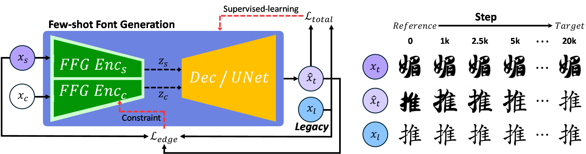
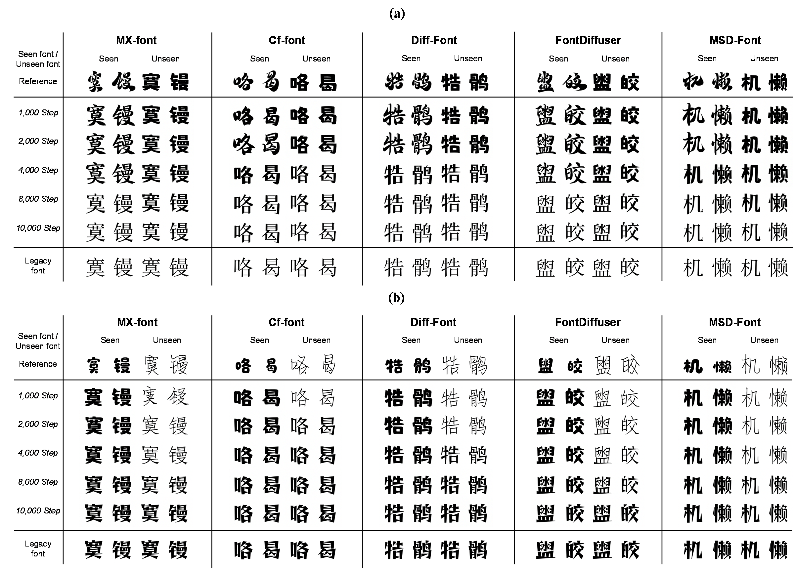

# Legacy Learning

This repository is the official implementation of the paper **[Legacy Learning Strategy Based on Few-Shot Font Generation Models for Automatic Text Design](https://doi.org/10.1016/j.ipm.2026.104721)**.

Legacy Learning is a model-agnostic fine-tuning strategy for few-shot font generation (FFG). The codebase separates the legacy-learning method from each FFG architecture: shared modules handle paired data loading, progressive content mixing, content preservation loss, checkpointing, and sampling, while model-specific behavior is isolated in adapters.

## Paper

- Title: Legacy Learning Strategy Based on Few-Shot Font Generation Models for Automatic Text Design
- Journal: Information Processing & Management, 63, 104721, 2026
- DOI: [10.1016/j.ipm.2026.104721](https://doi.org/10.1016/j.ipm.2026.104721)
- Authors: Younghwi Kim, Seok Chan Jeong, Dohee Kim, Sunghyun Sim

## Repository Layout

```text
legacy_learning/
  config.py          # YAML + CLI config loader
  datasets.py        # manifest-based paired dataset
  losses.py          # edge-map content preservation loss
  schedules.py       # beta schedules for progressive content mixing
  trainer.py         # model-agnostic training loop
models/adapters/
  base.py            # common adapter interface
  fontdiffuser.py    # implemented FontDiffuser adapter
  mxfont.py          # placeholder
  cffont.py          # placeholder
  difffont.py        # placeholder
  msdfont.py         # placeholder
configs/
  fontdiffuser_pretrain.yaml
  fontdiffuser_legacy.yaml
data/manifests/
  pretrain_train.csv
  legacy_train.csv
main.py              # training entrypoint
sample.py            # sampling entrypoint
```

## Installation

Create an environment that can run the original FFG model you want to use. For the current FontDiffuser adapter, install the original FontDiffuser requirements plus the dependencies here.

```powershell
pip install -r requirements.txt
```

If you use FontDiffuser, keep a local checkout of the original FontDiffuser implementation and pass it with `--model_repo`.

## Data Manifest

Training data is loaded from a CSV manifest. This repository intentionally does not include font images.

Required columns:

```csv
char,content_path,style_path,reference_path,legacy_path,target_path
```

Column meaning:

```text
content_path    Content glyph image used by the FFG model.
style_path      Style/reference glyph image used by the FFG model.
reference_path  Same-character reference glyph for progressive content mixing.
legacy_path     Same-character legacy glyph used as the legacy target.
target_path     Optional supervised target. If empty, legacy_path is used.
```

Paths may be absolute or relative to the manifest file.

## Dry Run

Check config loading without starting training:

```powershell
python main.py --config configs\fontdiffuser_legacy.yaml --dry_run
```

Check sampling arguments:

```powershell
python sample.py `
  --config configs\fontdiffuser_legacy.yaml `
  --checkpoint checkpoints\fontdiffuser_legacy_step_20000 `
  --content_image path\to\content.png `
  --style_image path\to\style.png `
  --dry_run
```

## Training

### FontDiffuser Pretraining

```powershell
python main.py `
  --config configs\fontdiffuser_pretrain.yaml `
  --model fontdiffuser `
  --model_repo C:\Users\user\Desktop\FontDiffuser-main `
  --data_manifest data\manifests\pretrain_train.csv `
  --output_dir outputs\fontdiffuser_pretrain
```

### FontDiffuser Legacy Fine-Tuning

```powershell
python main.py `
  --config configs\fontdiffuser_legacy.yaml `
  --model fontdiffuser `
  --model_repo C:\Users\user\Desktop\FontDiffuser-main `
  --base_checkpoint outputs\fontdiffuser_pretrain\global_step_60000 `
  --data_manifest data\manifests\legacy_train.csv `
  --output_dir outputs\fontdiffuser_legacy
```

Legacy fine-tuning loads the base checkpoint, switches to the reference-to-legacy paired manifest, enables progressive content mixing, and adds the content preservation loss.

The training loop saves step-wise checkpoints because intermediate checkpoints are meaningful generated styles:

```text
outputs/fontdiffuser_legacy/global_step_2500/
outputs/fontdiffuser_legacy/global_step_5000/
outputs/fontdiffuser_legacy/global_step_10000/
...
```

## Sampling

Apply one style image to one content image:

```powershell
python sample.py `
  --config configs\fontdiffuser_legacy.yaml `
  --model fontdiffuser `
  --model_repo C:\Users\user\Desktop\FontDiffuser-main `
  --checkpoint outputs\fontdiffuser_legacy\global_step_10000 `
  --content_image path\to\content.png `
  --style_image path\to\style.png `
  --output_dir outputs\samples `
  --save_triptych
```

Apply one style image to every content image in a folder:

```powershell
python sample.py `
  --config configs\fontdiffuser_legacy.yaml `
  --model fontdiffuser `
  --model_repo C:\Users\user\Desktop\FontDiffuser-main `
  --checkpoint outputs\fontdiffuser_legacy\global_step_10000 `
  --content_dir path\to\content_images `
  --style_image path\to\style.png `
  --output_dir outputs\samples
```

## How Model Switching Works

`main.py` and `sample.py` both resolve `--model` through `models/adapters/__init__.py`.

For a new FFG model, implement the adapter methods in `models/adapters/<model>.py`:

```python
build()
load_checkpoint()
save_checkpoint()
forward_train()
task_loss()
reconstruct_image()
build_sampler()
sample_image()
```

The trainer does not need to know whether the model is GAN-based or diffusion-based. The adapter converts model-specific inputs and outputs into the shared legacy-learning interface.

## Figures

The overall legacy learning pipeline progressively fine-tunes a pretrained FFG model toward a user-defined legacy font while constraining glyph structure through the content preservation loss.



The qualitative results below illustrate step-wise style transformation across representative FFG models. Intermediate checkpoints are treated as usable mixed-style fonts rather than only transient training states.



## Citation

If this repository is useful for your research, please cite:

```bibtex
@article{kim2026legacy,
  title = {Legacy Learning Strategy Based on Few-Shot Font Generation Models for Automatic Text Design},
  author = {Kim, Younghwi and Jeong, Seok Chan and Kim, Dohee and Sim, Sunghyun},
  journal = {Information Processing & Management},
  volume = {63},
  pages = {104721},
  year = {2026},
  doi = {10.1016/j.ipm.2026.104721}
}
```
